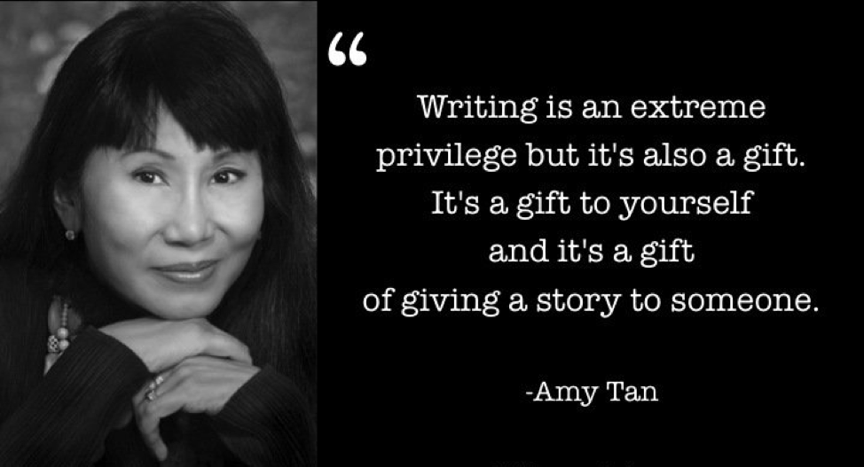

# Language and Identity

Have you ever thought about how language and identity are related? I bet you didn't. I know I didn't, at least until my English class.

Beside the fact, one of the biggest parts of your identity lies within language. It voices the inner monologue inside your head. It's how you communicate to others, how you're about to share your thoughts and feelings. They really do go hand in hand.

I know it may be difficult for some to relate to this, especially in the younger generation. Growing up, we all learn to speak English differently, or any other language for the matter. We struggle to fitting into an inherited culture and fall into an identity crisis as a result. In schools, students are emphasized in them the concept of Standard English. In doing so, they are exposed to something entirely different from what they previously know from home or anywhere else. This can cause a sense of confusion or "dis-belonging".

Standard English doesn't really exist anyway. There's no one who speaks standard english; we all speak with some sort of accent, no exceptions. This can be applied to anyone who speaks in a way that may not be considered the "correct" or "proper" way of doing so. Whatever it may be, the way one speaks should never be considered "wrong", because it isn't.

In Amy Tan's "Mother Tongue", she illustrates this concept with a story from her childhood. Tan highlights how people could not understand her mother's broken english but understood from her translations. She saw this identity crisis firsthand and knows it to be very real. But despite this, she proudly identifies herself as an Asian and an American. She speaks what many would consider "proper" english". She primarily identifies herself as a writer and speaks on how it has shaped her into the person she is today. Tan was someone whose identity was directly impacted by the language she grew up with. Through these experiences, she discovered herself for who she is: a writer.

This is a common to all those around the world, to everyone who identifies themselves with a language of some sort. How do you struggle with this issue and what have you done that has allowed you to get by it?
# Language and Identity

Have you ever thought about how language and identity are related? I bet you didn't. I know I didn't, at least until my English class.

Beside the fact, one of the biggest parts of your identity lies within language. It voices the inner monologue inside your head. It's how you communicate to others, how you're about to share your thoughts and feelings. They really do go hand in hand.

I know it may be difficult for some to relate to this, especially in the younger generation. Growing up, we all learn to speak English differently, or any other language for the matter. We struggle to fitting into an inherited culture and fall into an identity crisis as a result. In schools, students are emphasized in them the concept of Standard English. In doing so, they are exposed to something entirely different from what they previously know from home or anywhere else. This can cause a sense of confusion or "dis-belonging".

Standard English doesn't really exist anyway. There's no one who speaks standard english; we all speak with some sort of accent, no exceptions. This can be applied to anyone who speaks in a way that may not be considered the "correct" or "proper" way of doing so. Whatever it may be, the way one speaks should never be considered "wrong", because it isn't.

In Amy Tan's "Mother Tongue", she illustrates this concept with a story from her childhood. Tan highlights how people could not understand her mother's broken english but understood from her translations. She saw this identity crisis firsthand and knows it to be very real. But despite this, she proudly identifies herself as an Asian and an American. She speaks what many would consider "proper" english". She primarily identifies herself as a writer and speaks on how it has shaped her into the person she is today. Tan was someone whose identity was directly impacted by the language she grew up with. Through these experiences, she discovered herself for who she is: a writer.

This is a common to all those around the world, to everyone who identifies themselves with a language of some sort. How do you struggle with this issue and what have you done that has allowed you to get by it?
# ma1_revised
